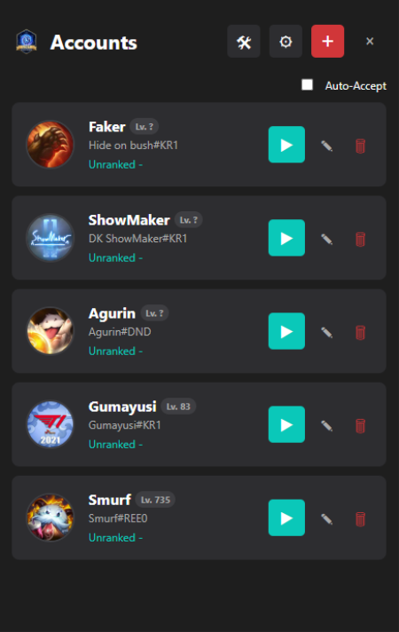

# Lost League Manager

<div align="center">
  
  <br><br>
  <a href="https://github.com/mauricekleindienst/lost-league-manager/releases/latest">
    
  </a>
</div>

**Lost League Manager** is a streamlined, lightweight utility designed to enhance your League of Legends experience. It replaces the standard launcher with a powerful multi-account manager that automates your login process and provides essential client tools.

## Key Features

- **Instant Auto-Login**: Securely store multiple accounts and log in with a single click. The app handles process termination and credential entry automatically.
- **Secure Input**: Features reliable input handling (mouse/keyboard locking) during login to ensure credentials are typed correctly every time.
- **Auto Queue & Accept**: Automatically start queuing for your preferred game mode and accept matches instantly.
- **Client Tools**:
    - **Fix Client**: Instantly kill all stuck League processes with one click.
    - **Customize Profile**: Set your profile background to any Champion or Skin.
    - **Lobby Tools**: Quick access to Dodge and OP.GG multi-search.
- **Multi-Language**: Fully localized interface supporting English usage for all regions.

## Installation

1.  Download the latest installer (.exe) from the Releases page.
2.  Run the setup file.
3.  Launch **Lost League Manager** from your desktop.

*Note: Run as Administrator for full Auto-Login functionality.*

## Troubleshooting

**Windows SmartScreen Warning**:
Because this app is new and doesn't have a paid certificate, Windows might stop it from running.
1.  **Right-click** the `Lost League Manager Setup.exe`.
2.  Select **Properties**.
3.  Check the **"Unblock"** box at the bottom.
4.  Click **Apply** and then **OK**.
5.  Run the installer again.

## Usage

1.  **Add Account**: Click the "+" button, enter your username, password, and region.
2.  **Login**: Click on any account card. The app will restart the League Client and log you in automatically.
    - **IMPORTANT**: Please wait and do not use your mouse or keyboard until the login is complete to ensure success.
3.  **Settings**: Configure your game path or change the client language via the Settings menu.

## Building from Source

To build the application locally:

1.  **Clone the repository**
    ```bash
    git clone https://github.com/mauricekleindienst/lost-league-manager.git
    cd leaguelogin
    ```
2.  **Install Dependencies**
    ```bash
    npm install
    ```
3.  **Run (Dev Mode)**
    ```bash
    npm start
    ```
4.  **Build Installer**
    ```bash
    npm run build
    ```

## Disclaimer

This software is an unofficial fan-made utility and is not endorsed by or affiliated with Riot Games. Use at your own risk.

---
*Developed by Lostgames*
